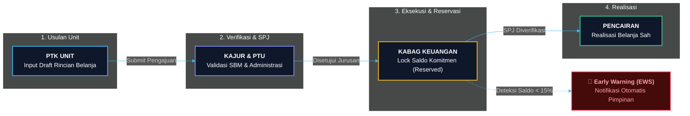
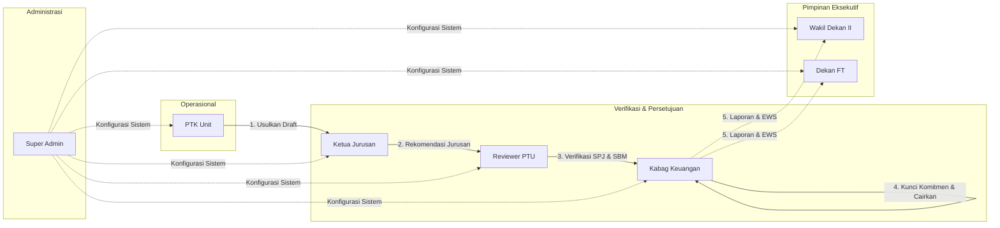
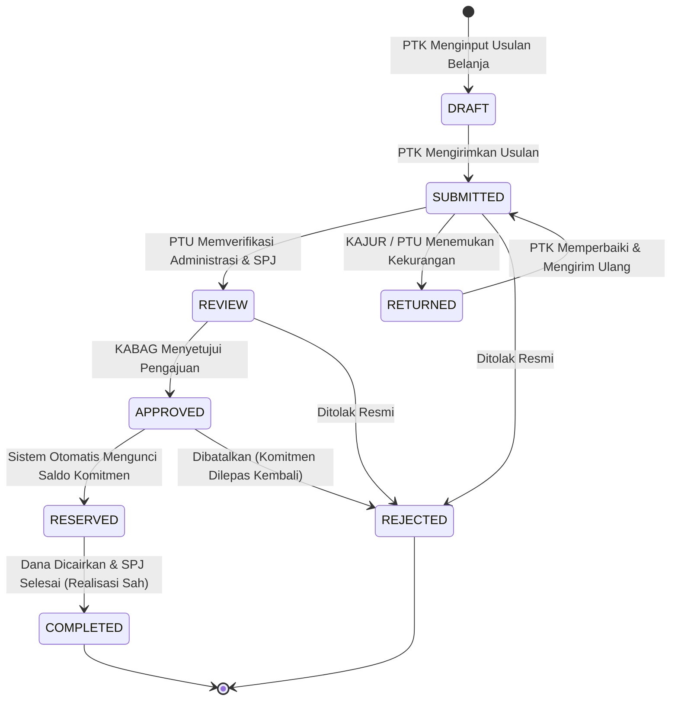

<p align="center">
  
</p>

<h1 align="center">SIPEDA FT UNSOED</h1>

<p align="center">
  <strong>Sistem Informasi Pagu & Pengendalian Anggaran</strong><br/>
  Fakultas Teknik &bull; Universitas Jenderal Soedirman
</p>

<p align="center">
  <a href="#-fitur-utama"></a>
  <a href="#-fitur-utama"></a>
  <a href="#-fitur-utama"></a>
  <a href="#-fitur-utama"></a>
  <a href="#-fitur-utama"></a>
  <a href="#-lisensi"></a>
  <a href="#-status"></a>
</p>

<p align="center">
  <strong><a href="#-quick-start">Quick Start</a></strong> &bull;
  <strong><a href="#-alur-workflow--siklus-pengajuan">Alur Workflow</a></strong> &bull;
  <strong><a href="#-matriks-7-peran-pengguna-rbac">Matriks 7 Role</a></strong> &bull;
  <strong><a href="#-arsitektur-sistem">Arsitektur</a></strong> &bull;
  <strong><a href="docs/">Dokumentasi Spesifikasi</a></strong>
</p>



---

## 📌 Ringkasan Eksekutif

**SIPEDA (Sistem Informasi Pagu & Pengendalian Anggaran)** adalah platform tata kelola dan kontrol keuangan institusi modern yang dirancang khusus untuk Fakultas Teknik Universitas Jenderal Soedirman. Sistem ini menjamin transparansi alokasi dana, otomatisasi komitmen belanja (*budget reservation locking*), deteksi dini anomali anggaran (*Rule-Based Early Warning System*), serta pelaporan real-time LRA (Laporan Realisasi Anggaran).

### Nilai Utama Sistem:
- **🔒 Atomic Commitment Locking** — Mencegah risiko *overbudget* dan *double-spending* secara otomatis saat pengajuan disetujui.
- **⚡ Proactive Early Warning System (EWS)** — Peringatan dini otomatis ketika saldo pagu kritis (< 15%) dan blokir transaksi defisit.
- **🛡️ 100% Audit Trail Security** — Seluruh mutasi pagu, revisi, dan transisi status tersimpan lengkap dengan alamat IP, timestamp, dan payload perubahan (*before vs after*).
- **👥 7-Tier Role-Based Access Control (RBAC)** — Pemisahan wewenang yang tegas dengan isolasi data tingkat unit kerja (*department-scoped*).
- **🚀 Modern Monolith Single-Page Application (SPA)** — Kombinasi Laravel + Inertia.js + Vue 3 untuk navigasi tanpa *full-page reload*.

---

## 🌟 Fitur Unggulan

| Modul | Kemampuan & Fungsi Utama | Dampak Operasional |
|---|---|---|
| **Executive Dashboard** | Visualisasi serapan per jurusan, metrik 4 kuadran (Pagu, Realisasi, Komitmen, Sisa Bebas), dan feed EWS. | Pengambilan keputusan cepat pimpinan (Dekan / WD II). |
| **Pagu & Revisi Anggaran** | Manajemen pos belanja (*Budget Buckets*), riwayat pergeseran pagu, input nominal berbasis *thousand-dot formatting* & ejaan terbilang. | Fleksibilitas pergeseran dana sesuai aturan APBN/BLU. |
| **Workflow Pengajuan Belanja** | Form dinamis multi-item barang/jasa, kalkulasi subtotal otomatis, dan verifikasi bertingkat. | Eliminasi pengajuan manual dan percepatan verifikasi SPJ. |
| **Rule Engine (EWS)** | Evaluasi ambang batas saldo kritis, kalkulasi deviasi realisasi, dan deteksi dini *under-spending*. | Mitigasi risiko keterlambatan serapan anggaran fakultas. |
| **Laporan Realisasi (LRA)** | Agregasi data real-time, filter per tahun anggaran & unit kerja, ringkasan per kode akun mata anggaran. | Akuntabilitas pelaporan keuangan tanpa jeda waktu rekonsiliasi. |
| **Master Data Terpadu** | CRUD Unit Kerja/Jurusan, Sumber Dana (BOPTN, PNBP, RM), dan Tahun Anggaran Aktif. | Kemudahan skalabilitas dan konfigurasi data institusi. |
| **Audit Trail Log** | Rekam jejak seluruh mutasi data dengan label *human-readable chips* dan penelusuran identitas aktor. | Kesiapan audit internal dan eksternal 100% *traceable*. |

---

## 👥 Matriks 7 Peran Pengguna (RBAC)

SIPEDA mengimplementasikan pemisahan tanggung jawab (*Separation of Duties*) yang ketat melalui 7 role pengguna:



| Role | Tingkat Otoritas | Cakupan Akses Data | Wewenang & Tanggung Jawab Utama |
|---|---|---|---|
| **PTK** | Operator Unit | Khusus Unit Sendiri (`department_id`) | Membuat draft usulan belanja (`DRAFT`), mengisi rincian barang/jasa, mengirimkan pengajuan (`SUBMITTED`), dan merevisi jika dikembalikan (`RETURNED`). |
| **KAJUR** | Persetujuan Jurusan | Unit Jurusan Terkait | Memeriksa urgensi belanja jurusan, memberikan persetujuan kegiatan (`APPROVED`), atau mengembalikan ke operator (`RETURNED`). |
| **PTU** | Verifikator Keuangan | Seluruh Fakultas Teknik | Memeriksa fisik SPJ, memvalidasi kepatuhan Standar Biaya Masukan (SBM), dan memberikan rekomendasi pencairan (`REVIEW`). |
| **KABAG** | Eksekutif Keuangan | Seluruh Fakultas Teknik | Memberikan persetujuan final tingkat fakultas, mengunci reservasi dana (`RESERVED`), mengeksekusi pencairan (`COMPLETED`), dan mengelola revisi pagu. |
| **WD** | Pimpinan (Executive) | Seluruh Fakultas Teknik | Memantau dashboard serapan fakultas, menerima peringatan EWS saldo kritis, dan mengevaluasi LRA strategis. |
| **DEKAN** | Pimpinan Tertinggi (KPA) | Seluruh Fakultas Teknik | Memegang kendali pengawasan performa anggaran komprehensif, evaluasi audit trail, dan otorisasi kebijakan belanja institusi. |
| **ADMIN** | Super Administrator | Konfigurasi Sistem Global | Mengelola akun pengguna, master unit kerja, master sumber dana, master tahun anggaran, dan memantau Audit Trail Log. |

---

## 🔄 Alur Workflow & Siklus Pengajuan

Setiap rupiah belanja melalui siklus hidup (*lifecycle state*) yang divalidasi oleh Rule Engine:



### Formula Perhitungan Saldo Pagu:
$$\text{Saldo Bebas (Available)} = \text{Pagu Aktif (Allocated)} - \left( \text{Realisasi (Realized)} + \text{Komitmen (Reserved)} \right)$$

---

## 🏗️ Arsitektur Sistem

SIPEDA mengadopsi pola **Modern Monolithic Layered Architecture**:

```
sipeda/
├── app/
│   ├── Http/
│   │   ├── Controllers/          # Controller Domain (Budget, Submission, Master, User, Audit)
│   │   ├── Middleware/           # Otentikasi, Role Authorization, HandleInertiaRequests
│   │   └── Requests/             # Form Request Validasi
│   ├── Models/                   # Eloquent Models (BudgetBucket, Submission, Department, AuditLog, dll.)
│   ├── Rules/                    # Domain Validation Rules
│   └── Services/                 # RuleEngine, BudgetService, AuditTrailService
├── database/
│   ├── migrations/               # Skema Relasional Basis Data
│   └── seeders/                  # Seeder Akun 7 Role & Data Awal SIPEDA
├── resources/
│   ├── js/
│   │   ├── Layouts/              # AppLayout (Responsive Drawer + White Theme)
│   │   ├── Pages/                # Landing, Auth/Login, Dashboard, Budgets, Submissions, Master, Reports
│   │   └── app.js                # Inisialisasi Inertia Vue 3
│   └── views/
│       └── app.blade.php         # Template Shell HTML & Favicon
└── routes/
    ├── web.php                   # Definisi Rute Web & RBAC Middleware
    └── api.php                   # Endpoint Integrasi & Eksternal
```

> 🗺️ **Peta Arsitektur Interaktif (Archify):** Buka [`docs/sipeda-architecture.html`](docs/sipeda-architecture.html) di browser Anda untuk menjelajahi diagram interaktif berfitur *live route trace*, *focus view*, *dark/light theme*, dan *export*.

---

## 🚀 Quick Start

Ikuti langkah-langkah berikut untuk menjalankan SIPEDA di lingkungan lokal pengembangan:

### 1. Kebutuhan Sistem (*Prerequisites*)
- **PHP:** Versi 8.3 atau lebih tinggi
- **Composer:** Versi 2.x
- **Node.js:** Versi 18.x / 20.x & NPM
- **Database:** MySQL 8.0+ / MariaDB 10.4+

### 2. Kloning & Instalasi Dependensi

```bash
# 1. Kloning repositori
git clone https://github.com/alpaenf/keudedek.git sipeda
cd sipeda

# 2. Instal dependensi PHP (Laravel)
composer install

# 3. Instal dependensi Javascript (Vue 3 & Vite)
npm install
```

### 3. Konfigurasi Environment (`.env`)

```bash
# Salin file konfigurasi environment
cp .env.example .env

# Generate encryption application key
php artisan key:generate
```

Sesuaikan kredensial basis data pada file `.env`:
```env
DB_CONNECTION=mysql
DB_HOST=127.0.0.1
DB_PORT=3306
DB_DATABASE=sipeda
DB_USERNAME=root
DB_PASSWORD=
```

### 4. Setup Database & Seeding Data

Anda dapat memilih salah satu dari dua metode di bawah:

**Opsi A: Menggunakan Database Migration & Seeder (Direkomendasikan)**
```bash
php artisan migrate:fresh --seed
```

**Opsi B: Mengimpor Database SQL Dump (`sipeda.sql`)**
```bash
# Impor file sipeda.sql ke database MySQL 'sipeda'
mysql -u root -p sipeda < sipeda.sql
```

### 5. Kompilasi Aset & Menjalankan Server

Jalankan server backend dan frontend secara bersamaan:

```bash
# Terminal 1: Menjalankan Laravel Development Server
php artisan serve

# Terminal 2: Menjalankan Vite Hot-Reload Development Server
npm run dev

# ATAU jika ingin melakukan build produksi langsung:
npm run build
```

Aplikasi siap diakses di peramban Anda melalui: **`http://127.0.0.1:8000`**

---

## 🔑 Kredensial Akun Uji Coba (*Demo Accounts*)

Semua akun default menggunakan kata sandi (*default password*): **`password`**

| Role | Alamat Email | Unit Kerja | Cakupan Akses |
|---|---|---|---|
| **Super Admin** | `admin@ft.unsoed.ac.id` | Fakultas Teknik | Akses Penuh Sistem & Master Data |
| **Dekan FT** | `dekan@ft.unsoed.ac.id` | Dekanat FT | Pengawasan Strategis & Kebijakan |
| **Wakil Dekan II** | `wd2@ft.unsoed.ac.id` | Dekanat FT | Executive Dashboard & LRA |
| **Kabag Keuangan** | `kabag.keuangan@ft.unsoed.ac.id` | Bagian Keuangan | Eksekusi Dana & Revisi Pagu |
| **Reviewer PTU** | `ptu@ft.unsoed.ac.id` | Bagian Keuangan | Verifikasi SPJ & Kepatuhan SBM |
| **Ketua Jurusan** | `kajur.informatika@ft.unsoed.ac.id` | Teknik Informatika | Approval Usulan Jurusan |
| **Operator PTK** | `ptk.informatika@ft.unsoed.ac.id` | Teknik Informatika | Input Usulan & Rincian Belanja |

> 💡 **Tip:** Anda dapat menggunakan fitur **Quick Demo Role** pada halaman login (`/login`) untuk beralih peran dalam 1-klik tanpa perlu mengetik ulang kredensial.

---

## 🧪 Pengujian & Standar Koding

```bash
# Menjalankan automated test suite (PHPUnit)
php artisan test

# Memformat dan memeriksa standar kode PHP (Laravel Pint)
vendor/bin/pint --format agent
```

---

## 📚 Dokumentasi Terkait

Spesifikasi teknis mendalam tersedia pada direktori [`/docs`](docs/):
- 📘 [`docs/PRD.md`](docs/PRD.md) — *Product Requirements Document*
- 📐 [`docs/ARCHITECTURE.md`](docs/ARCHITECTURE.md) — *Architecture & Layering Specification*
- 👥 [`docs/ROLES-WORKFLOW.md`](docs/ROLES-WORKFLOW.md) — *Role Governance & Business Workflow*
- ⚙️ [`docs/RULE-ENGINE.md`](docs/RULE-ENGINE.md) — *Early Warning System & Calculation Rules*
- 🗄️ [`docs/DATABASE.md`](docs/DATABASE.md) — *Relational Schema & Entity Relationship*
- 🔒 [`docs/AUDIT-SECURITY.md`](docs/AUDIT-SECURITY.md) — *Audit Trail & Security Policies*

---

## 📄 Lisensi

SIPEDA FT UNSOED dilisensikan di bawah [Lisensi MIT](LICENSE).

<p align="center">
  <sub>Dikembangkan untuk <strong>Fakultas Teknik Universitas Jenderal Soedirman (UNSOED)</strong> &bull; &copy; 2026 SIPEDA Team.</sub>
</p>
